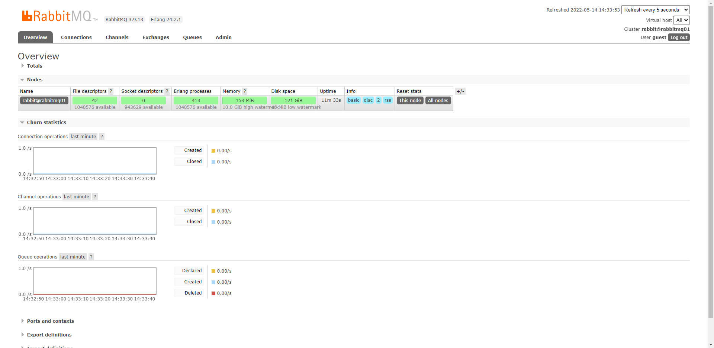

# Build a RabbitMQ cluster including HAPorxy by docker-composer

This article is composed of this part:

* Why do we need a RabbitMQ cluster?
* How many ways we can build a RabbitMQ cluster and which way is this article used?
* Some things we need to know before starting
* Build RabbitMQ cluster through CLI command manually
* Build RabbitMQ cluster through docker-composer
* Add HAProxy as load balance.
* Build by docker-compose
* Completed `docker-compose.yml` and directory structure
* Source code

<!--more-->

## Why do we need a RabbitMQ cluster?

---

Make sure that Producer and Consumer can still work even if one of a node in the cluster failed.

The cluster provides higher stability and also sacrifices part of the performance. 

Because nodes in the clusters have to sync messages to each other, this means that the more nodes exist in the cluster, the more time will be costed on syncing messages to each other.

## How many ways we can build  RabbitMQ cluster ?

---

According to rabbitmq’s official website, there are several ways to form a cluster:

- **Declaratively by listing cluster nodes in config file**
- **Declaratively using DNS-based discovery**
- Declaratively using AWS (EC2) instance discovery (via a plugin)
- Declaratively using Kubernetes discovery (via a plugin)
- Declaratively using Consul-based discovery (via a plugin)
- Declaratively using Consul-based discovery (via a plugin)
- **Manually with `rabbitmqctl`**

In this article, we will describe how to form rabbitmq cluster 

throught  **`rabbitmqctl` and use docker-compose to make this process automated.**

## Some things we need to know before starting

---

- The RabbitMQ cluster is based on Erlang. We need to start the Erlang node before we build the cluster.
    
    The communication between Erlang nodes is relying on Erlang Cookies, so we need to make all RabbitMQ nodes’ Erlang Cookies value the same.
    

## Build RabbitMQ cluster through **`rabbitmqctl`** manually

---

### Run three RabbitMQ container

---

- `docker run -d --hostname rabbitmq01 --name rabbit01 -e RABBITMQ_DEFAULT_USER=guest -e RABBITMQ_DEFAULT_PASS=guest -e RABBITMQ_ERLANG_COOKIE=myerlangcookies -p 5672:5672 -p 15672:15672 rabbitmq:3.9-management`
- `docker run -d --hostname rabbitmq02 --name rabbit02 -e RABBITMQ_DEFAULT_USER=guest -e RABBITMQ_DEFAULT_PASS=guest -e RABBITMQ_ERLANG_COOKIE=myerlangcookies -p 5673:5672 -p 15673:15672 rabbitmq:3.9-management`
- `docker run -d --hostname rabbitmq03 --name rabbit03 -e RABBITMQ_DEFAULT_USER=guest -e RABBITMQ_DEFAULT_PASS=guest -e RABBITMQ_ERLANG_COOKIE=myerlangcookies -p 5674:5672 -p 15674:15672 rabbitmq:3.9-management`

### Check Management UI

---

- [http://127.0.0.1:15672/](http://127.0.0.1:15672/#/)
- [http://127.0.0.1:15673/](http://127.0.0.1:15672/#/)
- [http://127.0.0.1:15674/](http://127.0.0.1:15672/#/)
    
    
    

### Get IP of rabbitmq containers

---

- `docker exec -it rabbit01 hostname -I`
    
    ```bash
    172.17.0.2
    ```
    
- `docker exec -it rabbit02 hostname -I`
    
    ```bash
    172.17.0.3
    ```
    
- `docker exec -it rabbit03 hostname -I`
    
    ```bash
    172.17.0.4
    ```
    

### Add IP to container’s hosts

---

- `docker exec -it rabbit01 bash`  & `docker exec -it rabbit02 bash`  & `docker exec -it rabbit03 bash`
- `apt-get update`
- `apt-get install vim`
- `vi /etc/hosts`
    
    Add this line (replace IP to the IP you get previous step):
    
    ```bash
    172.17.0.2      rabbitmq01
    172.17.0.3      rabbitmq02
    172.17.0.4      rabbitmq03
    ```
    

### RabbitMQ 2 and 3 join cluster

---

- Login rabbit02 & rabbit03:
    
     `docker exec -it rabbit02 bash`
    
- stop rabbitmq application:
    
    `rabbitmqctl stop_app`
    
    ```bash
    $ rabbitmqctl stop_app
    Stopping rabbit application on node rabbit@rabbitmq02 ...
    ```
    
- Join Cluster:
    
    `rabbitmqctl join_cluster rabbit@rabbitmq01`
    
    ```bash
    # rabbitmqctl join_cluster rabbit@rabbitmq01
    Clustering node rabbit@rabbitmq02 with rabbit@rabbitmq01
    ```
    
- Start App:
    
    `rabbitmqctl start_app`
    
    ```bash
    Starting node rabbit@rabbitmq02 ...
    ```
    
- After you done, you will see:
    
    
    

## Build RabbitMQ cluster through docker-composer

---

### First, let's look at  `dockerthe -compose.yml`

We make all services on same network, so we don’t need to handle hosts.

There are two types of rabbitmq service: master and slave, and use two different Dockerfile: `Dockerfile-master`, `Dockerfile-slave`

We volume  `/etc/rabbitmq/enabled_plugins` to control what plugin we open.

```yaml
version: "3"
networks:
  mqNetwork:
    driver: bridge
services:
  rabbitmq-cluster-01:
    build:
      context: ./rabbitmq
      dockerfile: Dockerfile-master
      args: 
        RABBITMQ_VERSION: 3.9
    hostname: rabbitmq-cluster-01
    container_name: rabbitmq-cluster-01
    ports:
      - 15672:15672
    environment:
      - RABBITMQ_NODENAME=rabbitmq
      - RABBITMQ_DEFAULT_USER=guest
      - RABBITMQ_DEFAULT_PASS=guest
      - RABBITMQ_NODENAME=rabbitmq@rabbitmq-cluster-01
    networks:
      - mqNetwork
    volumes:
      - ./rabbitmq/config/enabled_plugins:/etc/rabbitmq/enabled_plugins

  rabbitmq-cluster-02:
    build:
      context: ./rabbitmq
      dockerfile: Dockerfile-slave
      args: 
        RABBITMQ_VERSION: 3.9
    hostname: rabbitmq-cluster-02
    container_name: rabbitmq-cluster-02
    ports:
      - 15673:15672
    environment:
      - RABBITMQ_NODENAME=rabbitmq
      - RABBITMQ_DEFAULT_USER=guest
      - RABBITMQ_DEFAULT_PASS=guest
      - MASTER_NODE_HOST_NAME=rabbitmq@rabbitmq-cluster-01
    depends_on:
      - rabbitmq-cluster-01
    networks:
      - mqNetwork
    volumes:
      - ./rabbitmq/config/enabled_plugins:/etc/rabbitmq/enabled_plugins

  rabbitmq-cluster-03:
    build:
      context: ./rabbitmq
      dockerfile: Dockerfile-slave
      args: 
        RABBITMQ_VERSION: 3.9
    hostname: rabbitmq-cluster-03
    container_name: rabbitmq-cluster-03
    ports:
      - 15674:15672
    environment:
      - RABBITMQ_NODENAME=rabbitmq
      - RABBITMQ_DEFAULT_USER=guest
      - RABBITMQ_DEFAULT_PASS=guest
      - MASTER_NODE_HOST_NAME=rabbitmq@rabbitmq-cluster-01
    depends_on:
      - rabbitmq-cluster-01
    networks:
      - mqNetwork
    volumes:
      - ./rabbitmq/config/enabled_plugins:/etc/rabbitmq/enabled_plugins
	.
  .
  .
```

### Second, let’s look at two types of Dockerfile for build RabbitMQ :

`Dockerfile-master`

- Copy `.erlang.cookie` to `/var/lib/rabbitmq/.erlang.cookie` , so all of rabbitmq services have same `.erlang.cookie` .
- `[master.sh](http://master.sh)`  is start script for  master node.

```docker
ARG RABBITMQ_VERSION

FROM rabbitmq:$RABBITMQ_VERSION-management
COPY .erlang.cookie /var/lib/rabbitmq/.erlang.cookie
COPY master.sh /usr/local/bin/
ENTRYPOINT [ "/usr/local/bin/docker-entrypoint.sh" ]
CMD chmod 400 /var/lib/rabbitmq/.erlang.cookie && \
    /usr/local/bin/master.sh
```

`Dockerfile-slave`

- Copy `.erlang.cookie` to `/var/lib/rabbitmq/.erlang.cookie` , so all of rabbitmq services have same `.erlang.cookie` .
- `[slave.sh](http://slave.sh)` is start script for slave node.
- `tail -f /dev/null` is for keeping container running.

```docker
ARG RABBITMQ_VERSION

FROM rabbitmq:$RABBITMQ_VERSION-management
COPY .erlang.cookie /var/lib/rabbitmq/.erlang.cookie
COPY slave.sh /usr/local/bin/
ENTRYPOINT [ "/usr/local/bin/docker-entrypoint.sh" ]
CMD chmod 400 /var/lib/rabbitmq/.erlang.cookie && \
    /usr/local/bin/slave.sh && \
    tail -f /dev/null
```

### Third, two types of start script: `[master.sh](http://master.sh)` , `slave.sh`

`master.sh`

- master node just need to start server  —  start  erlang runtime and rabbitmq node

```bash
#!/bin/bash
# start rabbitmq service 
rabbitmq-server
```

`slave.sh`

- slave node start rabbitmq-server first and sleep sometime to make sure erlang runtime and rabbitmq node is prepared.
- execute  `stop_app`  to stop rabbitmq node and execute  `join_cluster`  to  become a member of the cluster
- execute `start_app` to start rabbitmq node again.

```bash
#!/bin/bash
# start rabbitmq service in backgorund (erlang node and rabbitmq application , detached mean in background)
rabbitmq-server -detached

sleep 15s

# Stops the RabbitMQ application, leaving the runtime (Erlang VM) running
rabbitmqctl stop_app

# Instructs the node to become a member of the cluster that the specified node is in
rabbitmqctl join_cluster ${MASTER_NODE_HOST_NAME}

# start rabbitmq application 來 sync 資料
rabbitmqctl start_app
```

### Dependence

- As a master node, rabbitmq-cluster-01 must start up first, and then other slave nodes like rabbitmq-cluster-02,  rabbitmq-cluster-03 ... etc.
- HAProxy should start up after all rabbitmq-cluster started up.

## Add HAProxy as load balance.

---

`docker-compose.yml`

```yaml
version: "3"
networks:
  mqNetwork:
    driver: bridge
services:
	.
	. 
	.
	haproxy:
	    build: 
	        context: ./haproxy
	        args: 
	          HAPROXY_VERSION: ${HAPROXY_VERSION}
	    container_name: haproxy
	    ports:
	      - 5672:5672
	      - 8100:8100
	    depends_on:
	      - rabbitmq-cluster-01
	      - rabbitmq-cluster-02
	      - rabbitmq-cluster-03
				- rabbitmq-cluster-04
	      - rabbitmq-cluster-05
	    networks:
	      - mqNetwork
	    volumes:
	     - ./haproxy/haproxy.cfg:/usr/local/etc/haproxy/haproxy.cfg
```

### Dockerfile for haproxy

```docker
ARG HAPROXY_VERSION
FROM haproxy:$HAPROXY_VERSION
```

### haproxy.cfg

```docker
#--------------------------------------------------------------------- 
# common defaults that all the 'listen' and 'backend' sections will 
# use if not designated in their block 
#--------------------------------------------------------------------- 
global
daemon

    defaults
    mode tcp
    maxconn 10000
    timeout connect 5s
    timeout client 100s
    timeout server 100s

frontend stats
    *bind *:8100*
    mode http
    stats enable
    stats uri /stats
    stats refresh 10s
    stats admin if LOCALHOST

frontend rabbitmq
    bind *:5672
    use_backend rabbitmq-server

backend rabbitmq-server
    balance roundrobin
    server rabbitmaster rabbitmq-cluster-01:5672 check inter 5s rise 2 fall 3
    server rabbitslave1 rabbitmq-cluster-02:5672 check inter 5s rise 2 fall 3
	  server rabbitslave2 rabbitmq-cluster-03:5672 check inter 5s rise 2 fall 3
    server rabbitslave3 rabbitmq-cluster-04:5672 check inter 5s rise 2 fall 3
    server rabbitslave4 rabbitmq-cluster-05:5672 check inter 5s rise 2 fall 3
```

## Completed `docker-compose.yml` and directory structure

---

### Completed `docker-compose.yml`

```yaml
version: "3"
networks:
  mqNetwork:
    driver: bridge
services:
  rabbitmq-cluster-01:
    build:
      context: ./rabbitmq
      dockerfile: Dockerfile-master
      args: 
        RABBITMQ_VERSION: 3.9
    hostname: rabbitmq-cluster-01
    container_name: rabbitmq-cluster-01
    ports:
      - 15672:15672
    environment:
      - RABBITMQ_NODENAME=rabbitmq
      - RABBITMQ_DEFAULT_USER=guest
      - RABBITMQ_DEFAULT_PASS=guest
      - RABBITMQ_NODENAME=rabbitmq@rabbitmq-cluster-01
    networks:
      - mqNetwork
    volumes:
      - ./rabbitmq/config/enabled_plugins:/etc/rabbitmq/enabled_plugins

  rabbitmq-cluster-02:
    build:
      context: ./rabbitmq
      dockerfile: Dockerfile-slave
      args: 
        RABBITMQ_VERSION: 3.9
    hostname: rabbitmq-cluster-02
    container_name: rabbitmq-cluster-02
    ports:
      - 15673:15672
    environment:
      - RABBITMQ_NODENAME=rabbitmq
      - RABBITMQ_DEFAULT_USER=guest
      - RABBITMQ_DEFAULT_PASS=guest
      - MASTER_NODE_HOST_NAME=rabbitmq@rabbitmq-cluster-01
    depends_on:
      - rabbitmq-cluster-01
    networks:
      - mqNetwork
    volumes:
      - ./rabbitmq/config/enabled_plugins:/etc/rabbitmq/enabled_plugins

  rabbitmq-cluster-03:
    build:
      context: ./rabbitmq
      dockerfile: Dockerfile-slave
      args: 
        RABBITMQ_VERSION: 3.9
    hostname: rabbitmq-cluster-03
    container_name: rabbitmq-cluster-03
    ports:
      - 15674:15672
    environment:
      - RABBITMQ_NODENAME=rabbitmq
      - RABBITMQ_DEFAULT_USER=guest
      - RABBITMQ_DEFAULT_PASS=guest
      - MASTER_NODE_HOST_NAME=rabbitmq@rabbitmq-cluster-01
    depends_on:
      - rabbitmq-cluster-01
    networks:
      - mqNetwork
    volumes:
      - ./rabbitmq/config/enabled_plugins:/etc/rabbitmq/enabled_plugins

  rabbitmq-cluster-04:
    build:
      context: ./rabbitmq
      dockerfile: Dockerfile-slave
      args: 
        RABBITMQ_VERSION: 3.9
    hostname: rabbitmq-cluster-04
    container_name: rabbitmq-cluster-04
    ports:
      - 15675:15672
    environment:
      - RABBITMQ_NODENAME=rabbitmq
      - RABBITMQ_DEFAULT_USER=guest
      - RABBITMQ_DEFAULT_PASS=guest
      - MASTER_NODE_HOST_NAME=rabbitmq@rabbitmq-cluster-01
    depends_on:
      - rabbitmq-cluster-01
    networks:
      - mqNetwork
    volumes:
      - ./rabbitmq/config/enabled_plugins:/etc/rabbitmq/enabled_plugins

  rabbitmq-cluster-05:
    build:
      context: ./rabbitmq
      dockerfile: Dockerfile-slave
      args: 
        RABBITMQ_VERSION: 3.9
    hostname: rabbitmq-cluster-05
    container_name: rabbitmq-cluster-05
    ports:
      - 15676:15672
    environment:
      - RABBITMQ_NODENAME=rabbitmq
      - RABBITMQ_DEFAULT_USER=guest
      - RABBITMQ_DEFAULT_PASS=guest
      - MASTER_NODE_HOST_NAME=rabbitmq@rabbitmq-cluster-01
    depends_on:
      - rabbitmq-cluster-01
    networks:
      - mqNetwork
    volumes:
      - ./rabbitmq/config/enabled_plugins:/etc/rabbitmq/enabled_plugins

  haproxy:
    build: 
        context: ./haproxy
        args: 
          HAPROXY_VERSION: ${HAPROXY_VERSION}
    container_name: haproxy
    ports:
      - 5672:5672
      - 8100:8100
    depends_on:
      - rabbitmq-cluster-01
      - rabbitmq-cluster-02
      - rabbitmq-cluster-03
      - rabbitmq-cluster-04
      - rabbitmq-cluster-05
    networks:
      - mqNetwork
    volumes:
     - ./haproxy/haproxy.cfg:/usr/local/etc/haproxy/haproxy.cfg
```

### Directory Structure


## Build by docker-compose

---

- `docker-compose up -d`
    
    ```bash
    [+] Building 2.7s (27/33)
     => [rabbitmq-cluster-env_rabbitmq-cluster-05 internal] load build definition from Dockerfil  0.0s 
     => => transferring dockerfile: 409B                                                          0.0s 
     => [rabbitmq-cluster-env_rabbitmq-cluster-02 internal] load build definition from Dockerfil  0.0s 
     => => transferring dockerfile: 409B                                                          0.0s 
     => [rabbitmq-cluster-env_rabbitmq-cluster-01 internal] load build definition from Dockerfil  0.0s 
     => => transferring dockerfile: 384B                                                          0.0s 
     => [rabbitmq-cluster-env_rabbitmq-cluster-03 internal] load build definition from Dockerfil  0.0s 
     => => transferring dockerfile: 409B                                                          0.0s 
     => [rabbitmq-cluster-env_haproxy internal] load build definition from Dockerfile             0.0s 
     => => transferring dockerfile: 87B                                                           0.0s 
     => [rabbitmq-cluster-env_rabbitmq-cluster-04 internal] load build definition from Dockerfil  0.1s 
     => => transferring dockerfile: 409B                                                          0.0s 
     => [rabbitmq-cluster-env_rabbitmq-cluster-05 internal] load .dockerignore                    0.0s 
     => => transferring context: 2B                                                               0.0s 
     => [rabbitmq-cluster-env_rabbitmq-cluster-02 internal] load .dockerignore                    0.0s 
     => => transferring context: 2B                                                               0.0s 
     => [rabbitmq-cluster-env_rabbitmq-cluster-01 internal] load .dockerignore                    0.0s 
     => => transferring context: 2B                                                               0.0s 
     => [rabbitmq-cluster-env_rabbitmq-cluster-03 internal] load .dockerignore                    0.0s 
     => => transferring context: 2B                                                               0.0s 
     => [rabbitmq-cluster-env_haproxy internal] load .dockerignore                                0.0s
     => => transferring context: 2B                                                               0.0s 
     => [rabbitmq-cluster-env_rabbitmq-cluster-04 internal] load .dockerignore                    0.0s 
     => => transferring context: 2B                                                               0.0s 
     => [rabbitmq-cluster-env_rabbitmq-cluster-04 internal] load metadata for docker.io/library/  0.0s 
     => [rabbitmq-cluster-env_rabbitmq-cluster-04 1/4] FROM docker.io/library/rabbitmq:3.9-manag  0.0s 
     => [rabbitmq-cluster-env_rabbitmq-cluster-05 internal] load build context                    0.0s 
     => => transferring context: 530B                                                             0.0s 
     => CACHED [rabbitmq-cluster-env_rabbitmq-cluster-01 2/4] RUN echo "Build version: 3.9.13"    0.0s 
     => CACHED [rabbitmq-cluster-env_rabbitmq-cluster-05 3/4] COPY .erlang.cookie /var/lib/rabbi  0.0s 
     => [rabbitmq-cluster-env_rabbitmq-cluster-05 4/4] COPY slave.sh /usr/local/bin/              0.0s 
     => [rabbitmq-cluster-env_rabbitmq-cluster-02 internal] load build context                    0.0s 
     => => transferring context: 530B                                                             0.0s 
     => [rabbitmq-cluster-env_rabbitmq-cluster-01 internal] load build context                    0.0s 
     => => transferring context: 210B                                                             0.0s 
     => [rabbitmq-cluster-env_haproxy] exporting to image                                         0.2s 
     => => exporting layers                                                                       0.0s 
     => => writing image sha256:7cb933b9ff00e6c50cc84042063f5df6bcb118b205b64096a4c6fdf8dc6b297c  0.0s 
     => => naming to docker.io/library/rabbitmq-cluster-env_rabbitmq-cluster-05                   0.0s 
     => => naming to docker.io/library/rabbitmq-cluster-env_rabbitmq-cluster-02                   0.0s 
     => => naming to docker.io/library/rabbitmq-cluster-env_rabbitmq-cluster-03                   0.0s 
     => => naming to docker.io/library/rabbitmq-cluster-env_rabbitmq-cluster-04                   0.0s 
     => => writing image sha256:de6b6cf48cfa0b1123f4fc2922ad1f116528b766c7850f856c6ce5220bade7b6  0.0s 
     => => naming to docker.io/library/rabbitmq-cluster-env_rabbitmq-cluster-01                   0.0s 
     => => writing image sha256:274925b27a9e25ff77b491434e1e96255a3ef882038e88a3aa75be4990ffd1e6  0.0s 
     => => naming to docker.io/library/rabbitmq-cluster-env_haproxy                               0.0s 
     => [rabbitmq-cluster-env_rabbitmq-cluster-03 internal] load build context                    0.1s 
     => => transferring context: 530B                                                             0.0s 
     => [rabbitmq-cluster-env_haproxy internal] load metadata for docker.io/library/haproxy:2.3   2.2s 
     => CACHED [rabbitmq-cluster-env_rabbitmq-cluster-01 3/4] COPY .erlang.cookie /var/lib/rabbi  0.0s 
     => [rabbitmq-cluster-env_rabbitmq-cluster-01 4/4] COPY master.sh /usr/local/bin/             0.1s 
     => [rabbitmq-cluster-env_rabbitmq-cluster-04 internal] load build context                    0.1s 
     => => transferring context: 530B                                                             0.0s 
     => CACHED [rabbitmq-cluster-env_haproxy 1/1] FROM docker.io/library/haproxy:2.3@sha256:7a9b  0.0s
    
    [+] Running 7/7
     - Network rabbitmq-cluster-env_mqNetwork  Create...                                          0.7s 
     - Container rabbitmq-cluster-01           Started                                            2.5s
     - Container rabbitmq-cluster-02           Started                                            6.4s
     - Container rabbitmq-cluster-04           Started                                            5.3s 
     - Container rabbitmq-cluster-03           Started                                            5.1s 
     - Container rabbitmq-cluster-05           Started                                            6.1s 
     - Container haproxy                       Started                                            8.0s
    ```
    
- Check RabbitMQ management GUI:  [http://127.0.0.1:15672/](http://localhost:15672/#/)
    
    
    
- Check  HAProxy stats page: [http://127.0.0.1:8100/stats](http://127.0.0.1:8100/stats)
    
    
    
## Source Code
---
* [Github Link](https://github.com/chun-hunag/rabbitmq-sample/tree/main/rabbitmq-cluster-env)

## Reference

---

- [https://www.rabbitmq.com/clustering.html](https://www.rabbitmq.com/clustering.html)
- [http://kuma-uni.blogspot.com/2017/03/rabbitmqha-rabbitmq-1.html](http://kuma-uni.blogspot.com/2017/03/rabbitmqha-rabbitmq-1.html)
- [https://blog.yowko.com/docker-compose-rabbitmq-cluster/](https://blog.yowko.com/docker-compose-rabbitmq-cluster/)