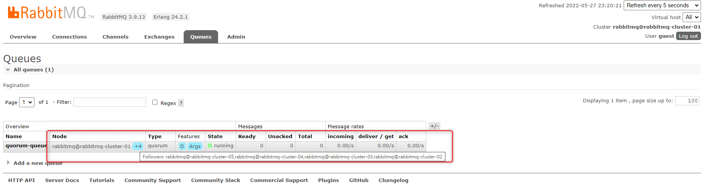

# Declare Quorum queue with go language

[Last article](https://jam-boxes.com/build-a-rabbitmq-cluster-including-haporxy-by-docker-composer/) we describe how to build a RabbitMQ cluster, and this article we will show that declare quorum queue with go and do some simple test to quorum queue.

## What we need?

---

- library for RabbitMQ: `github.com/streadway/amqp`
- GoLang
- A RabbitMQ Cluster - You can use way last article described or use other way official website do.

<!--more-->

## Initialize and connect to RabbitMQ

---

First, we write a `rabbitMQService` package to handle detail of RabbitMQ.

- RabbitMQService struct:
    
    ```go
    type RabbitMQService struct {
    	account    string
    	password   string
    	host       string
    	vhost      string
    	connection *amqp.Connection
    	channel    *amqp.Channel
    }
    ```
    
- Constructor:
    
    Simply hard-code config, but this is only for  demo conveniently.
    
    ```go
    func NewRabbitMQService() *RabbitMQService {
    	// should be replaced by env config load
    	account := "guest"
    	password := "guest"
    	host := "localhost:5672"
    	vhost := "/"
    	rabbitMQService := &RabbitMQService{account: account, password: password, host: host, vhost: vhost}
    	rabbitMQService.getConnection()
    	rabbitMQService.getChannel()
    	rabbitMQService.SetQos(1, 0)
    	return rabbitMQService
    }
    ```
- Connect and open channel
    
    ```go
    func (r *RabbitMQService) getConnection() *amqp.Connection {
    	connection, err := amqp.Dial(fmt.Sprintf("amqp://%s:%s@%s%s", r.account, r.password, r.host, r.vhost))
    	failOnError(err, "Failed to connect to RabbitMQ")
    	r.connection = connection
    	return r.connection
    }
    
    func (r *RabbitMQService) getChannel() *amqp.Channel {
    	if r.connection == nil {
    		log.Fatalf("%s", "Connection is nil.")
    	}
    
    	channel, err := r.connection.Channel()
    	failOnError(err, "Failed to open a channel")
    	r.channel = channel
    	return r.channel
    }
    ```
    
- Close connection and  channel
    
    ```go
    func (r *RabbitMQService) Close() {
    	if r.channel != nil {
    		err := r.channel.Close()
    		failOnError(err, "Failed to close channel.")
    	}
    
    	if r.connection != nil {
    		err2 := r.connection.Close()
    		failOnError(err2, "Failed to close connection.")
    	}
    }
    ```
    

## Declare Exchange

---

Define a `ExchangeType` type and constant help we to choose exchange type

```go
type ExchangeType string

const (
	Direct  ExchangeType = "direct"
	Topic   ExchangeType = "topic"
	Headers ExchangeType = "headers"
	Fanout  ExchangeType = "fanout"
)

func (r *RabbitMQService) ExchangeDeclare(name string, exchangeType ExchangeType) {
	err := r.channel.ExchangeDeclare(
		name, // name
		string(exchangeType), // type
		true, // durable
		false, // autoDelete
		false, // internal
		false, // noWait
		nil, // args
	)
	failOnError(err, "Failed to declare an exchange")
}
```

## Declare Quorum Queue

---

In order to specify queue’s type, we need to use `amqp.Table` and set “`x-queue-type" = "quorum"` and `"x-quorum-initial-group-size" = "5"` .

- `x-queue-type` :  set queue’s type. the default value is classic.
- `x-quorum-initial-group-size`:  set this argument to control the number of quorum queue members.

```go
func (r *RabbitMQService) QuorumQueueDeclare(name string) {
	if r.isReady() {
		table := amqp.Table{}
		table["x-queue-type"] = "quorum"
		table["x-quorum-initial-group-size"] = 5

		_, err := r.channel.QueueDeclare(
			name,  // name
			true,  // quorum queue most be durable
			false, // delete when unused
			false, // exclusive
			false, // no-wait
			table, // arguments
		)
		failOnError(err, "Failed to declare a queue")
	}
}
```

## Queue bind to Exchange

---

```go
func (r *RabbitMQService) QueueBind(queueName, routingKey, exchangeName string) {
	if r.isReady() {
		err := r.channel.QueueBind(
			queueName,
			routingKey,
			exchangeName,
			false,
			nil,
		)
		failOnError(err, "Failed to QueueBind")
	}
}
```

## Publish and Consume

---

- Publish
    
    ```go
    func (r *RabbitMQService) Publish(exchangeName, routineKey, body string) {
    	if r.isReady() {
    		err := r.channel.Publish(
    			exchangeName, // exchange
    			routineKey,   // routing key
    			false,        // mandatory
    			false,        // immediate
    			amqp.Publishing{
    				DeliveryMode: amqp.Persistent,
    				ContentType:  "text/plain",
    				Body:         []byte(body),
    			},
    		)
    		failOnError(err, "Failed to publish a message")
    		log.Printf(" [x] Sent %s", body)
    	}
    }
    ```
    
- Consume
    
    ```go
    func (r *RabbitMQService) Consume(queueName, consumerName string) <-chan amqp.Delivery {
    	messages, err := r.channel.Consume(
    		queueName,    // name
    		consumerName, // consumer tags
    		false,        // auto-ack
    		false,        // exclusive
    		false,        // no-local
    		false,        // no-wait
    		nil,          // args
    	)
    	failOnError(err, "Failed to register a consumer")
    	return messages
    }
    ```
    

## Server Side Code

---

- responsible for  declare queue, exchange and bind it.
- consume queue
- receive message and log message.

```go
package main

import (
	"./helper"
	"./rabbitMQService"
	"log"
)

func main() {
	mqService := rabbitMQService.NewRabbitMQService()
	queueName := "quorum-queue"
	mqService.QuorumQueueDeclare(queueName)
	mqService.ExchangeDeclare("quorum.exchange", rabbitMQService.Fanout)
	mqService.QueueBind(queueName, "quorum.queue", "quorum.exchange")
	deliverChan := mqService.Consume(queueName, "client")
	defer func() {
		mqService.Close()
	}()

	forever := make(chan bool)
	go func() {
		for d := range deliverChan {
			message := string(d.Body)
			log.Printf("%s%s", "Consume message: ", message)
			err := d.Ack(false)
			helper.FailOnError(err, "Failed to ack a message")
		}
	}()

	log.Printf(" [*] Awaiting Message")
	<-forever
}
```

Usage:

```go
$ go run .\server.go
2022/05/27 22:37:35  [*] Awaiting Message
2022/05/27 23:14:52 Consume message: 0
2022/05/27 23:14:52 Consume message: 1
2022/05/27 23:14:52 Consume message: 2
2022/05/27 23:14:52 Consume message: 3
2022/05/27 23:14:52 Consume message: 4
```

## Client Side Code

---

- Publish message
- Take in an argument to decide  how many messages were published

```go
package main

import (
	"./helper"
	"./rabbitMQService"
	"os"
	"strconv"
)

func main() {
	n := getArgs(os.Args)
	mqService := rabbitMQService.NewRabbitMQService()

	for i := 0; i < n; i++ {
		mqService.Publish("quorum.exchange", "quorum.queue", strconv.Itoa(i))
	}
}

func getArgs(args []string) int {
	var s string
	if (len(args) < 2) || os.Args[1] == "" {
		helper.FailOnError(nil, "wrong or absent Args")
	} else {
		s = args[1]
	}

	n, err := strconv.Atoi(s)
	if err != nil {
		helper.FailOnError(err, "Args not integer")
	}

	return n
}
```

Usage:

```go
> go run .\client.go 5 
2022/05/27 23:14:52  [x] Sent 0
2022/05/27 23:14:52  [x] Sent 1
2022/05/27 23:14:52  [x] Sent 2
2022/05/27 23:14:52  [x] Sent 3
2022/05/27 23:14:52  [x] Sent 4
```

## Inspect Quorum Queue On RabbitMQ GUI

---

After declaring quorum queue on server side, we can see quorum queue displayed on GUI like this:

- [http://localhost:15672/](http://localhost:15672/)



- The `+4` mean that there are `1 + 4`  node exists quorum-queue
- The extra information tell that the quorum queue at `rabbitmq-cluster-02`, `rabbitmq-cluster-03`, `rabbitmq-cluster-04` , `rabbitmq-cluster-05` are follower.

Now, we first stop server side program temporarily, and use client program to  send some message for testing.

we send 10 message first:

```go
$ go run .\client.go 10
2022/05/27 23:30:23  [x] Sent 0
2022/05/27 23:30:23  [x] Sent 1
2022/05/27 23:30:23  [x] Sent 2
2022/05/27 23:30:23  [x] Sent 3
2022/05/27 23:30:23  [x] Sent 4
2022/05/27 23:30:23  [x] Sent 5
2022/05/27 23:30:23  [x] Sent 6
2022/05/27 23:30:23  [x] Sent 7
2022/05/27 23:30:23  [x] Sent 8
```

There are 10 message on queue:


Then we stop the first node of RabbitMQ cluster for testing.

```go
$ docker-compose stop rabbitmq-cluster-01
[+] Running 1/1
 - Container rabbitmq-cluster-01  Stopped
```

Now first node is down.


Then we go to check quorum queue:


You can see these message still there and the master node change from `rabbitmq-cluster-01` to `rabbitmq-cluster-05` .

Therefore, when we use quorum queue, we can make sure that The Message Broker  has high availability. 

The Consumer and The Publisher still can work even one of  RabbitMQ node down.

## Conclusion

---

- The most usage of quorum queue is same as classic queue beside we need to declare queue by setting `x-queue-type=quorum` .
- The quorum queue with RabbitMQ cluster can provide high availability to your Message Broker System.
- Another queue was used  to be used on RabbitMQ cluster is  Mirrored Queues.
    
    Since the official website say  “Quorum queues should be considered the default option for a replicated queue type.”,  
    
    we don’t use it unless you have own reasons.
    

## Source Code

---

code: https://github.com/chun-hunag/rabbitmq-sample/tree/main/golang/QuorumQueue

environment: https://github.com/chun-hunag/rabbitmq-sample/tree/main/rabbitmq-cluster-env