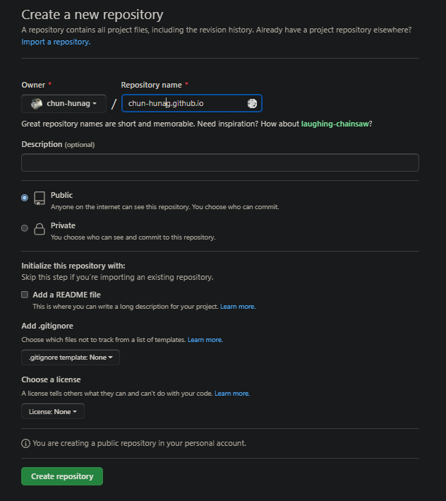
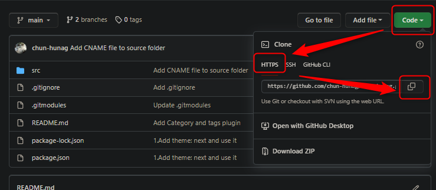
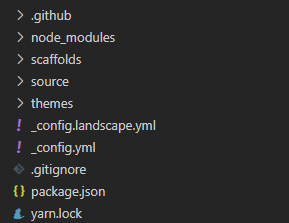
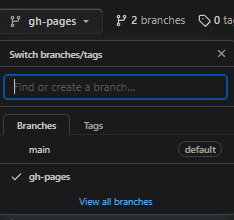
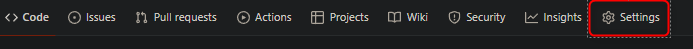
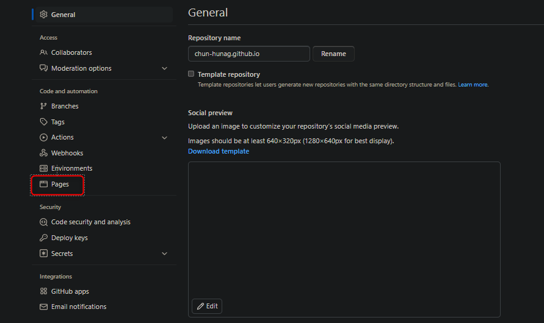
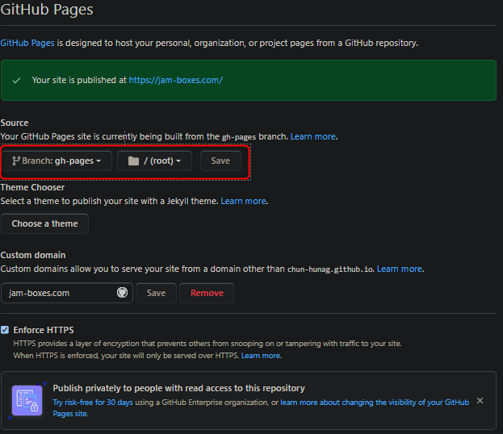

# How to build blog by hexo with theme “next".

---

## Prerequisite

---

- A GitHub account
- Node.js runtime environment
- Git

## Create a Repository with `{user_name}.github.io`

---

1. Create Repository
    
    `{user_name}` must be the same as your github’s username.
    
    
    
2. Clone your repository to local.
    
    
    
3. Execute command locally:
    
    `$ git clone {what you just copy}`
    
    Example:  `$ git clone  https://github.com/{user-name}/{user-name}.github.io.git`
    

## Install hexo by npm & Initialize the project

---

- `$ npm install -g hexo-cli`
- `$ cd {your repository local directory}`
- `$ mkdir src`
- `$ cd src`
- `hexo init`
    
    You should see:
    
    ```jsx
    INFO  Cloning hexo-starter https://github.com/hexojs/hexo-starter.git
    INFO  Install dependencies
    warning hexo-renderer-stylus > stylus > css-parse > css > source-map-resolve@0.5.3: See https://github.com/lydell/source-map-resolve#deprecated
    warning hexo-renderer-stylus > stylus > css-parse > css > urix@0.1.0: Please see https://github.com/lydell/urix#deprecated
    warning hexo-renderer-stylus > stylus > css-parse > css > source-map-resolve > urix@0.1.0: Please see https://github.com/lydell/urix#deprecated
    warning hexo-renderer-stylus > stylus > css-parse > css > source-map-resolve > resolve-url@0.2.1: https://github.com/lydell/resolve-url#deprecated
    warning hexo-renderer-stylus > stylus > css-parse > css > source-map-resolve > source-map-url@0.4.1: See https://github.com/lydell/source-map-url#deprecated
    INFO  Start blogging with Hexo!
    ```
    
- Directory structure like below:
    
    
    

## Config deployment setting

---

- Modify  `src/_config.yml`
    
    ```json
    # Deployment
    ## Docs: https://hexo.io/docs/one-command-deployment
    deploy:
      type: git
      repo: https://github.com/{user_name}/{user_name}.github.io
      branch: gh-pages
    ```
    

## Download themes

---

- URL: [https://github.com/theme-next/hexo-theme-next](https://github.com/theme-next/hexo-theme-next)
- `$ cd src/themes`
- `$ git clone https://github.com/theme-next/hexo-theme-next.git`
- rename folder to next:
    
    `$ mv hexo-theme-next/ next`
    

## Config themes

---

- Modify  `src/_config.yml`
    
    ```json
    # Exensions
    ## Plugins: https://hexo.io/plugins/
    ## Themes: https://hexo.io/themes/
    theme: next
    ```
    

## Deployment

---

- `$ cd src/`
- `$ hexo generate`
- `$ hexo deploy`
- Go to your repository page on Github and you should see one more branch show up
    
    
    
- config page setting
    1. Click Setting
        
        
        
    2. Click Pages
        
        
        
    3. Set Soruce branch to gh-pages
        
        
        
- Check your page on url: `<username>.github.io`